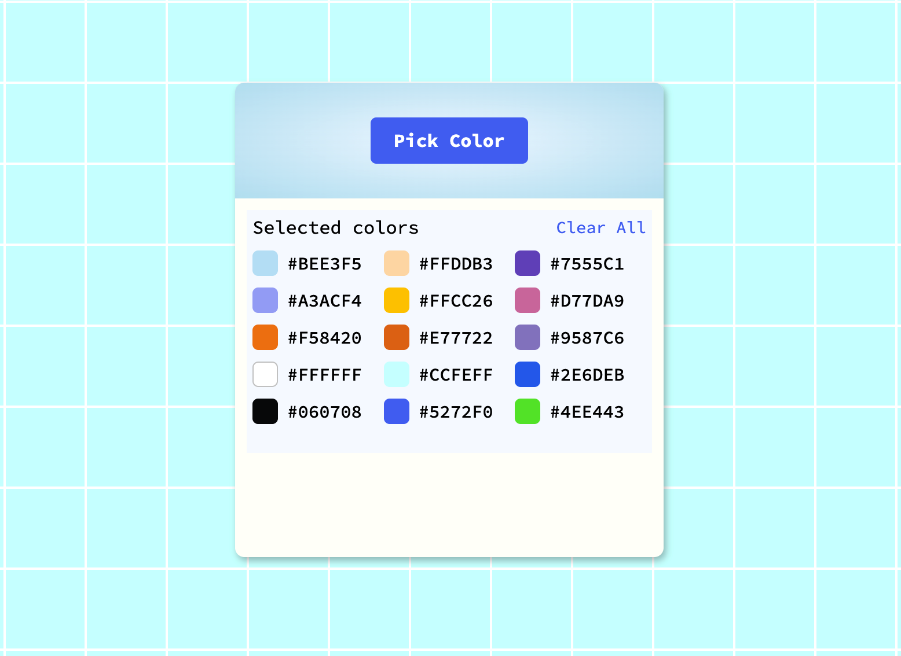

# Color Picker

This tool will help you to easily pick the colors from any image. This way you can easily expand your color collection. Include them all in your designs and layouts.


## Installation

1. Clone the repository:
   ```bash
   git clone https://github.com/tpreisig/color-selection.git
   ```
2. Navigate to the project directory:
   ```bash
   cd color-selection
   ```
3. Run the application:
   ```bash
   open index.html
   ```

## License

This project is licensed under the MIT License - see the [LICENSE](LICENSE) file for details.

## Screenshots



## Contact

Maintained by tpreisig - feel free to reach out!
