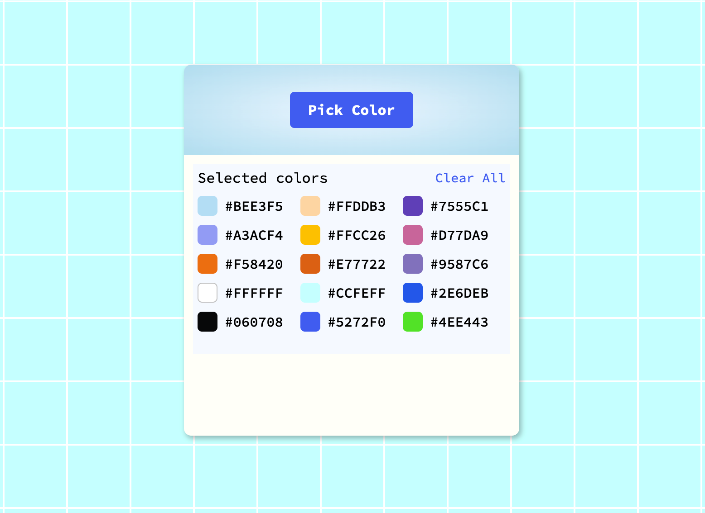

# Color Picker Application

A web-based color picker application that allows users to select colors from their screen using the EyeDropper API, store the selected colors in local storage, and copy color codes to the clipboard. The application also provides an option to clear all selected colors.

## Application

## Features

- **Color Selection**: Use the EyeDropper API to pick colors from anywhere on the screen.
- **Color Storage**: Save selected colors in the browser's local storage for persistence across sessions.
- **Copy to Clipboard**: Click on a color code to copy it to the clipboard with a visual confirmation.
- **Clear All**: Remove all stored colors with a single click.
- **Responsive Design**: Basic styling for a clean and user-friendly interface.

## Prerequisites

- The EyeDropper API is an experimental web standard that allows JavaScript to trigger a native browser eyedropper tool for selecting colors from anywhere on the user's screen (including outside the browser window).
- A modern web browser that supports the [EyeDropper API](https://developer.mozilla.org/en-US/docs/Web/API/EyeDropper) (e.g. Google Chrome, Microsoft Edge).
- ☝️ The EyeDropper is not supported in Firefox as of September 2025. 
- No external dependencies or libraries are required.

## Installation

1. Clone or download the repository to your local machine.
2. Open the `index.html` file in a compatible browser.

## License

This project is licensed under the MIT License - see the [LICENSE](LICENSE) file for details.

## Contact

Maintained by tpreisig - feel free to reach out!
